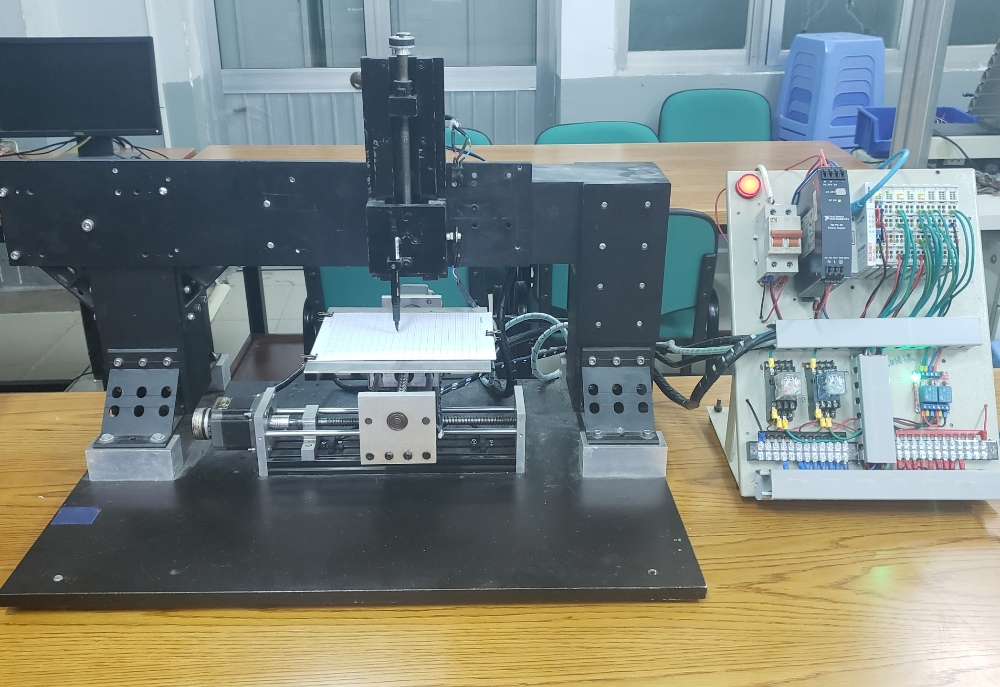
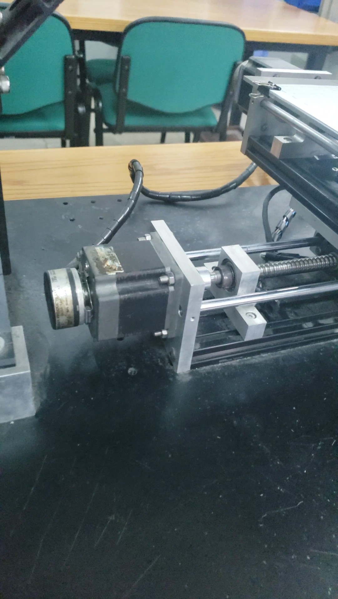
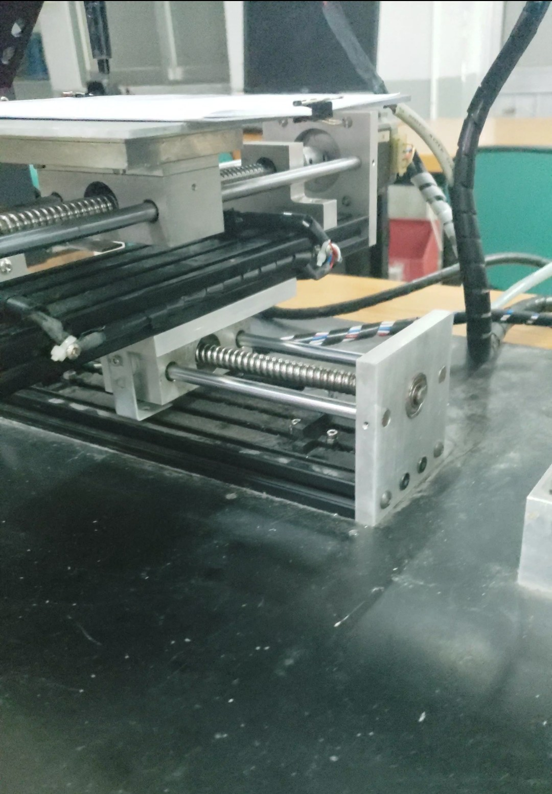
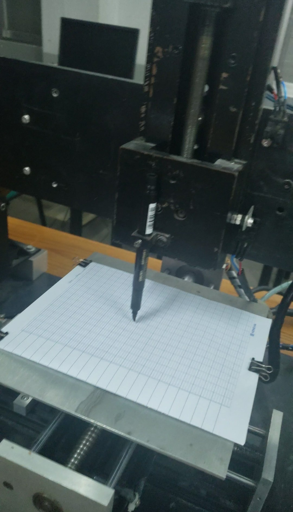
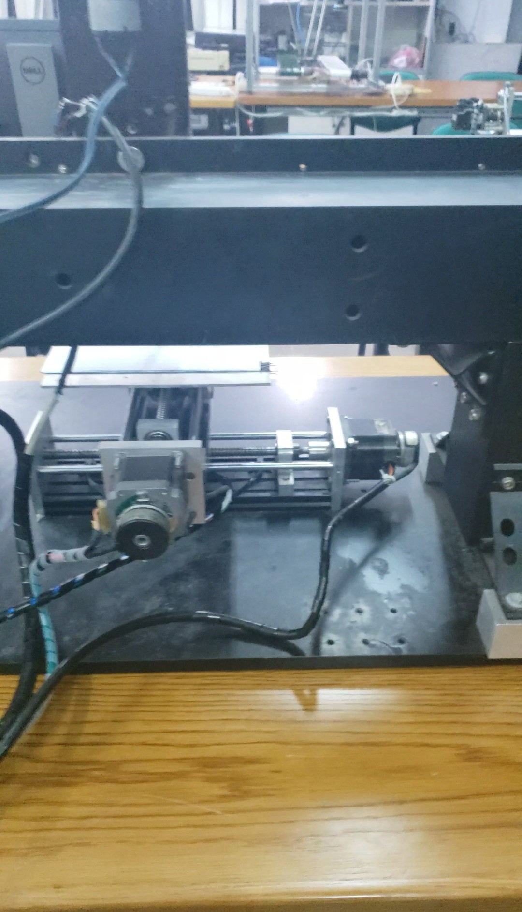
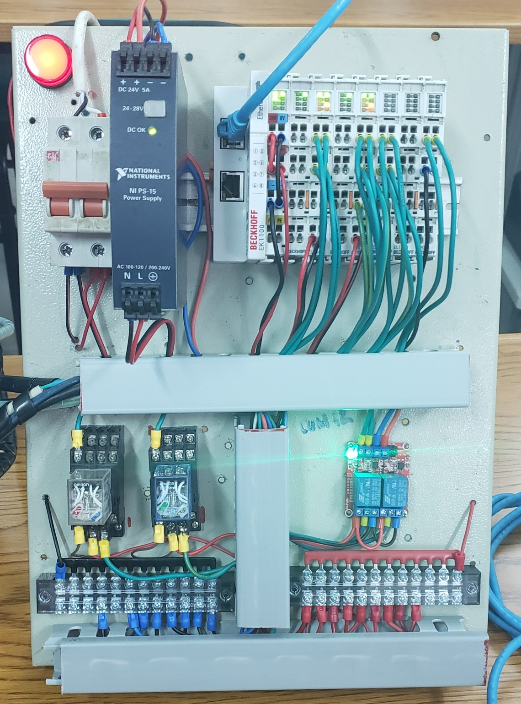
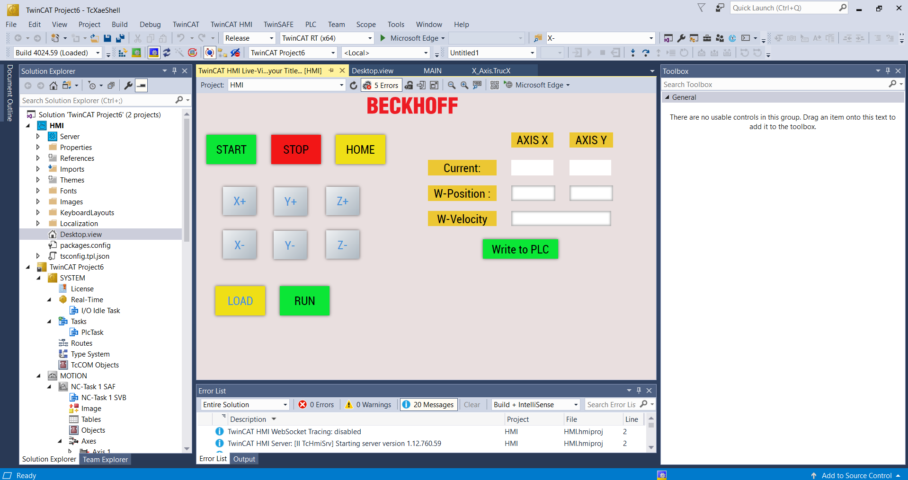
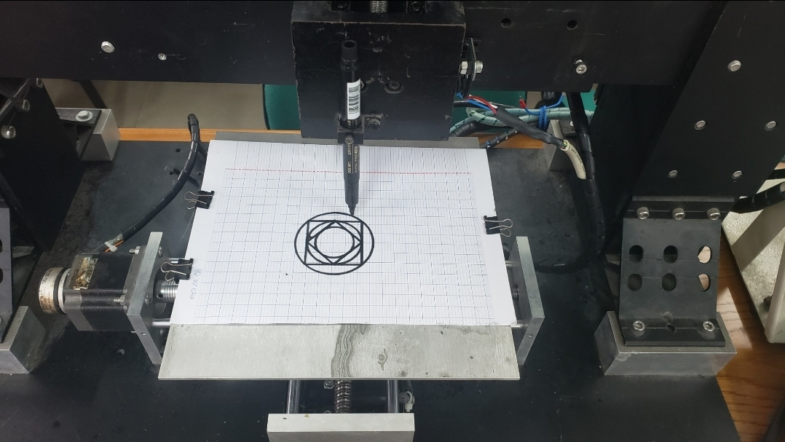
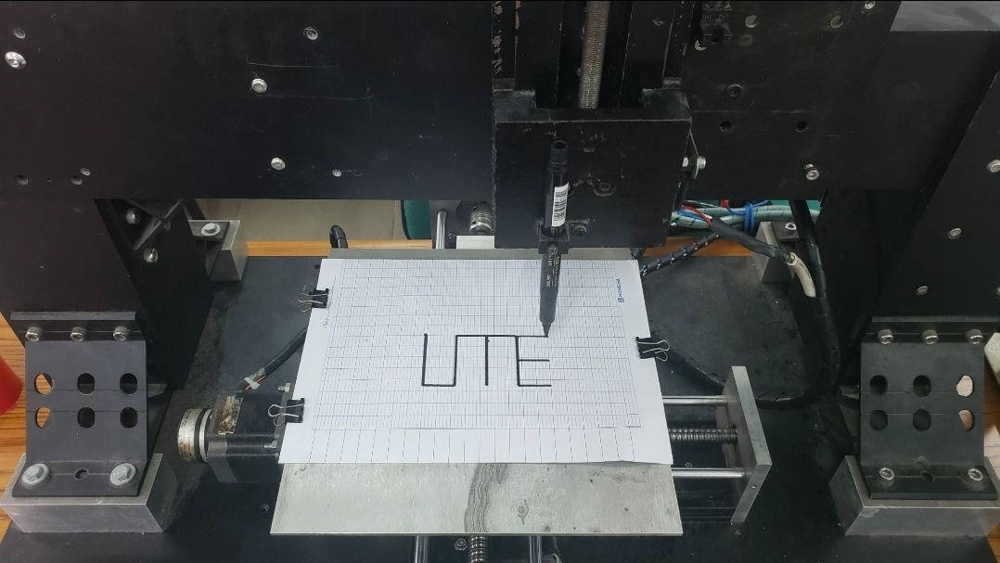
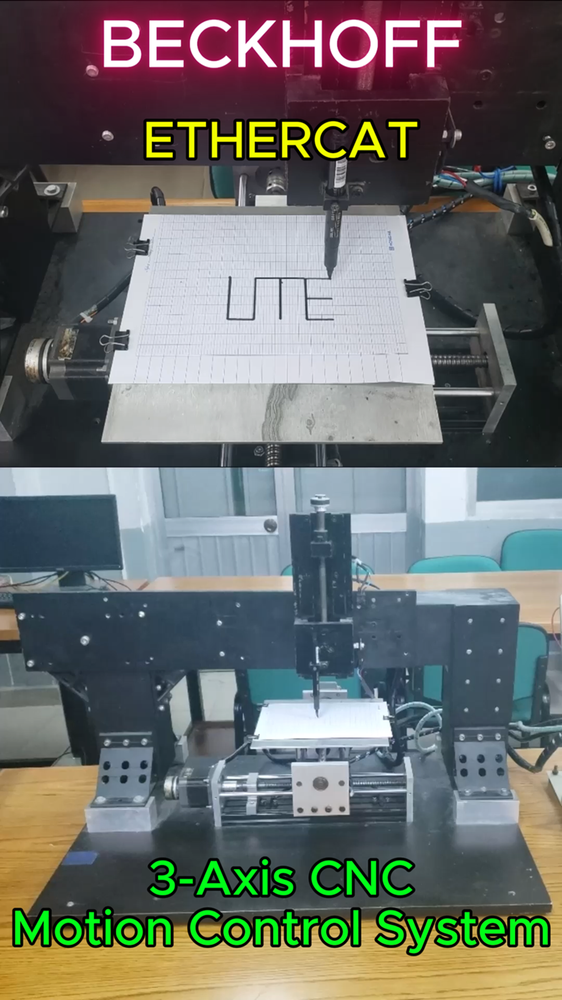

# ⚙️ CNC 3-Axis Model using EtherCAT & TwinCAT 3
**Author:** Kaël Shelby (VTN)
## 📖 Introduction
- This project focuses on the **design and implementation of a 3-axis CNC machine model using the EtherCAT protocol**.  
- The system is built on **Beckhoff TwinCAT 3**, combined with the **EtherCAT Coupler EK1100** and extension modules for stepper motor control.

**Main Objectives:**
- Understand and implement the **EtherCAT protocol** in industrial applications.
- Apply algorithms for motion control and trajectory interpolation.
- Develop an intuitive **HMI interface** in TwinCAT 3.

## Overview

### 🛠️ Hardware

  
  
  

  
  
  

<em>3-Axis Motion Control System</em>

### 💻 Software

<em>Control interface implemented in TwinCAT 3</em>

## 📊 Results

After completing the design and programming, the system was successfully tested.  
Key achievements include:

<em>Interpolation of basic geometric shapes</em>

<em>Interpolation of text "UTE"</em>

## 🎥 Video Demo

👉 [Watch the demo video on TikTok](https://www.tiktok.com/@kshelbyiot/video/7531961342513712391?is_from_webapp=1&sender_device=pc&web_id=7500959777037518344)

  

<em>Video: 3-Axis CNC Motion Control System</em>

## 🛠️ System Requirements

### Hardware
- Beckhoff EtherCAT Coupler **EK1100**
- Stepper motor control module **EL7041**
- Digital input module **EL1008**
- Digital output module **EL2004**
- 3 stepper motors + ball screws
- 24V DC power supply

### Software
- **TwinCAT 3** (Beckhoff)
- **Visual Studio 2017/2019** (with TwinCAT XAE integration)

## 📂 How to Open the Project
- Clone the repository to your local machine
- Open **TwinCAT 3** in Visual Studio  
- Go to `File > Open > Project/Solution`  
- Navigate to the folder **TwinCAT Project6** and open the `.tsproj` file
